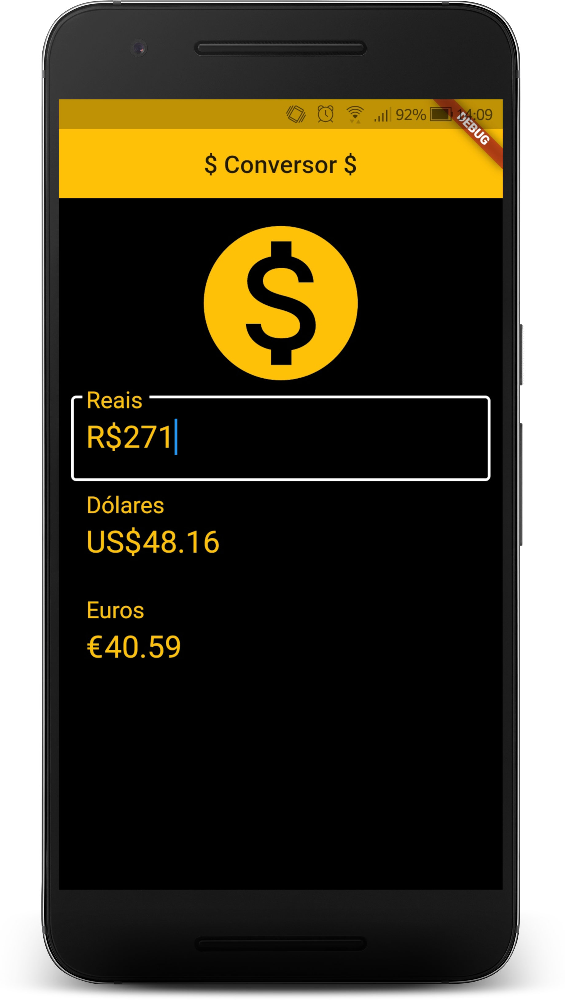

# Conversor de Moeda

* Um app que faz a conversão instantânea entre Reais, Dólares e Euros.

## Como utilizar
Para utilizar o app, siga os seguintes passos:
* Fazer cadastro no site [HG Brasil](https://hgbrasil.com/status/finance);
* Criar um token;
* Na pasta do projeto "lib/main.dart", trocar o valor da contante request após "json&key=" para o seu token.
