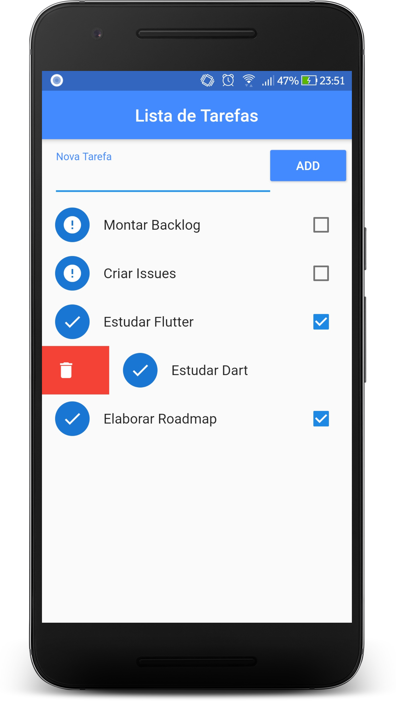

# Todolist

  

* Um app para criação de tarefas, no qual pode ser marcado se ela foi finalizada ou não. Como uma funcionalidade adicional, é possível remover as tarefas deslizando-as na horizontal.
